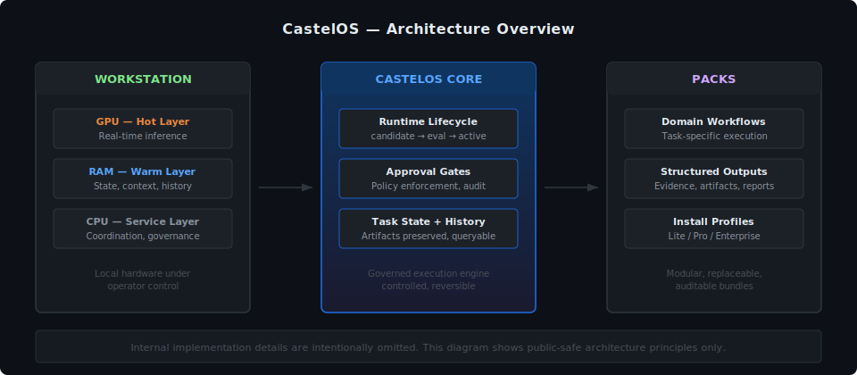
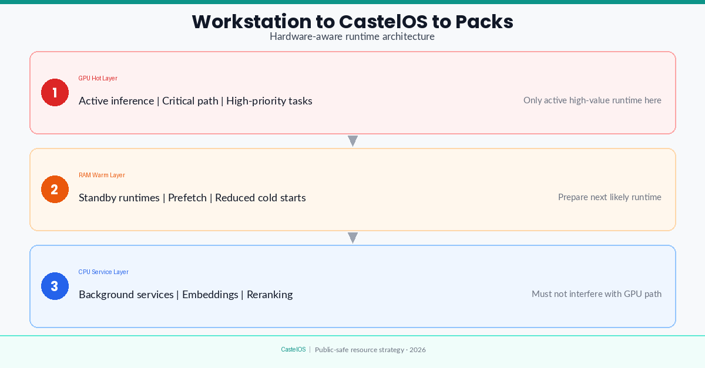

# CastelOS — Public Artifacts

> Principles, architecture insights, and build-in-public content from the CastelOS project.

## What is CastelOS

CastelOS is a **local-first AI execution system** designed to run on real hardware and turn one powerful workstation into a controlled engine for business workflows.

Instead of scattered SaaS tools and random AI wrappers, CastelOS provides:

- **Governed runtimes** — every task runs with structure, evidence, and audit trails
- **Hardware-aware routing** — capabilities matched to GPU / RAM / CPU resources
- **Knowledge automation** — structured flows instead of manual copy-paste
- **Domain packs** — installable workflow profiles for specific business scenarios

## What you'll find here

This repository contains public artifacts from the CastelOS build-in-public journey:

- Architecture principles and design decisions
- System thinking notes and execution frameworks
- Weekly insights from building a local-first AI OS

## System architecture

CastelOS operates as three integrated layers:

  

### 1. Workstation

The hardware foundation where the system runs.
Local-first design means the workstation is not just a client — it is the operating base.
Hardware decisions shape runtime behavior, memory strategy, and latency expectations.

### 2. Core

The governed execution engine.

- Manages runtime lifecycle (candidate → eval → shadow → approved → active)
- Enforces approval gates for important outputs
- Maintains task state and artifact history
- Handles runtime upgrades safely and reversibly

### 3. Packs

Installable execution bundles.

- Each pack encodes a task, a workflow, or a domain capability
- Packs execute against the core's governed runtimes
- Outputs are structured, queryable, and preservable
- Packs can be replaced, audited, or rolled back without cascading failures

### Why this structure matters

This three-layer design separates concerns:

- **Hardware** stays under local control
- **Runtime** stays governed and measurable
- **Execution** stays modular and reversible

No layer depends on external defaults or SaaS-only choices. The operator makes the call.

## Local-first design

CastelOS runs on your workstation. Not as a thin client that calls an API, but as the actual execution layer.

GPU handles model inference. On an RTX 5090 32 GB, that means Qwen2.5-32B runs always-on at 4-bit quantization, comfortably within VRAM limits. R1 is available via hot-swap when heavier reasoning is needed, but both models cannot run simultaneously on a single GPU. The system checks available memory before loading anything.

RAM stores model state, task context, and recent outputs. 96 GB DDR5 means the warm layer can hold standby runtimes, prefetched context, and output history without hitting swap. If a model gets evicted from GPU, it goes to RAM first. Checking task history does not require a database round-trip.

CPU runs the control plane. On a Ryzen 9 9950X3D, that means approval checks, lifecycle decisions, and scheduling all happen with headroom to spare. Not on the hot path for inference.

Cloud is available if you configure it explicitly. Some tasks might need an external API call. But the default is local, and any external call is logged and auditable.

  

## Philosophy

- **System over model** — the value is in orchestration, not in any single LLM
- **Execution over chat** — real outputs with artifacts, not just conversations
- **Governance over hype** — controlled, repeatable, auditable workflows
- **Local-first** — privacy, speed, and ownership by design

## About the builder

**Dmytro Romanov** — AI Systems Builder and Local-First AI Architect.

I design and build local-first AI systems that combine hardware-aware runtime strategy, orchestration, knowledge automation, governance, and productized outputs.

